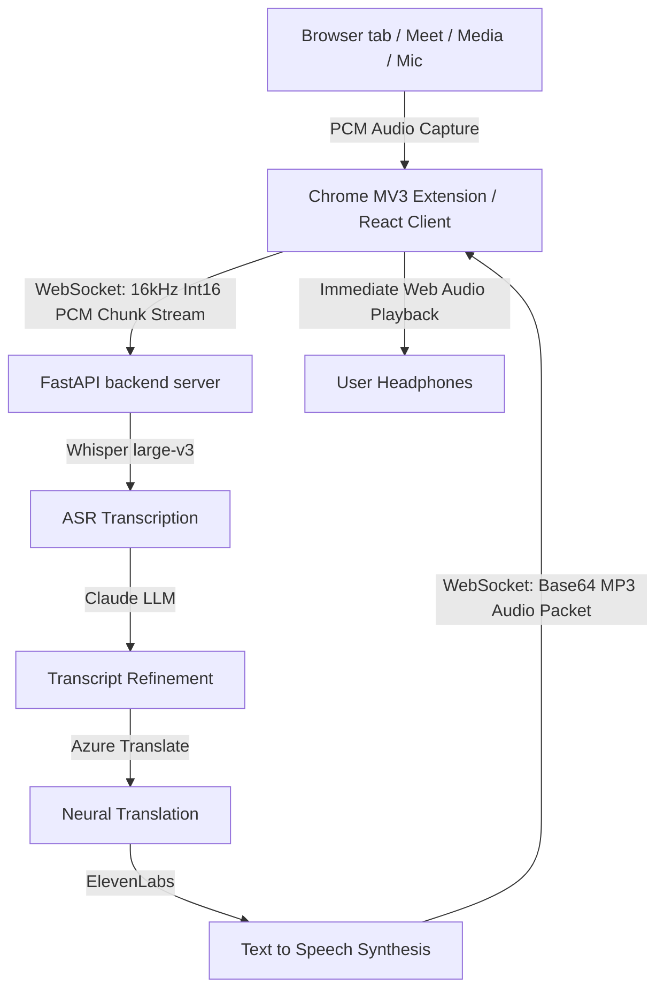

# Voxa AI - Project Architecture & Technical Flow Documentation

This document provides a comprehensive technical overview of Voxa AI's systems, streaming pipelines, Chrome Extension mechanics, and data flows. Designed as an interview-ready reference, it explains key engineering decisions, API choices, and architectural boundaries.

---

## 🧭 System Architecture Overview

Voxa AI is a real-time, low-latency machine translation ecosystem designed to capture, process, and voice-synthesize tab media stream feeds or microphone inputs.



---

## ⚡ Architectural Boundaries & Flow Pipelines

### 1. Chrome Extension Flow (Manifest V3)
* **Draggable Shadow DOM Overlay (`content.js`)**:
  To prevent global CSS resets on commercial web platforms (e.g. Udemy, YouTube, Google Meet) from breaking the control panel, the overlay is injected inside a **Shadow DOM**. Drag event offsets update absolute coordinate positions in real time.
* **Persistent Service Worker (`background.js`)**:
  When the overlay panel is closed, translation persists. The Service Worker coordinates the session using `chrome.storage.local` to remain persistent across popup reloads and tab changes.
* **Tab Capture & Offscreen Sandbox (`offscreen.js` & `offscreen.html`)**:
  Under Manifest V3, Service Workers cannot access Web Audio APIs. To bypass this restriction, the worker requests a stream ID via `chrome.tabCapture.getMediaStreamId` and opens a secure **Offscreen Document**. The offscreen document runs the `AudioContext` and handles incoming translation speech.

### 2. Audio Downsampling Pipeline
Raw tab capture or mic streams run at 44.1kHz or 48kHz stereo.
* To minimize bandwidth overhead (cutting traffic by **6x**), the extension downsamples captured audio to **16kHz mono**.
* In `onaudioprocess`, Float32 samples from the browser are scaled and packed into 16-bit signed integer PCM (`Int16Array` buffers) before being streamed to the server.

### 3. WebSocket Real-Time Translation Stream
Unlike batch APIs that repeatedly upload whole audio files via HTTP, Voxa uses persistent WebSockets for sub-second latencies:
* **Audio Buffering**: The backend buffers incoming PCM binary frames. Once the buffer hits a 3-second threshold (96,000 bytes at 16kHz), it extracts the chunk for translation.
* **Whisper ASR (via Groq)**: The PCM chunk is written into a memory WAV container and fed to Whisper `whisper-large-v3` for sub-second transcription.
* **Claude Refinement (via OpenRouter)**: Whisper outputs are corrected for spelling and grammar to optimize context before translation.
* **Azure NMT**: Polishes the transcript into the target language.
* **ElevenLabs Speech Synthesis**: Converts the text to voice bytes in memory.
* **Base64 Payload Delivery**: The voice bytes are base64-encoded and returned directly within the persistent WebSocket connection as a JSON payload, avoiding file disk overwriting and network caching.

---

## 📂 Repository Folder Structure

```
Voxa-ai/
├── Backend/                 # Python FastAPI backend server
│   ├── app/
│   │   ├── api/             # HTTP & WebSockets controllers (websocket_api.py, speech.py)
│   │   ├── core/            # System configurations
│   │   └── services/        # ASR, Azure translation, and ElevenLabs TTS services
│   ├── venv/                # Local python virtual environment
│   └── requirements.txt     # Python backend dependencies
├── Frontend/                # Client side React application
│   └── my-app/
│       ├── public/          # Public assets & zipped Chrome extension package
│       │   ├── voxa_extension/      # Unpacked Extension root source (manifest.json at root)
│       │   └── voxa_extension.zip   # Downloadable packed extension for users
│       ├── src/
│       │   ├── app/         # Pages & routing views (workspace, pdf-reader, design-system)
│       │   └── components/  # Floating glassmorphic header, shims, and UI templates
│       ├── tsconfig.json    # TypeScript configurations
│       └── vite.config.ts   # Vite bundler configs featuring Next.js shims
└── ARCHITECTURE.md          # Architectural and Technical Flow Guide (This file)
```

---

## 🛠️ Environment Variables & Configuration

### Backend Environment (`Backend/.env`)
Create a `.env` file under the `Backend` directory:
```env
# Groq ASR API Key
GROQ_API_KEY=gsk_xxx

# ElevenLabs Speech Synthesis Credentials
ELEVENLABS_API_KEY=xxx

# Azure Translator Credentials
AZURE_TRANSLATOR_KEY=xxx
AZURE_TRANSLATOR_REGION=global
AZURE_TRANSLATOR_ENDPOINT=https://api.cognitive.microsofttranslator.com/

# OpenRouter (Claude Transcript Refinement)
OPENROUTER_API_KEY=sk-or-xxx
```

---

## 🚀 How to Run and Load the Ecosystem

### Step 1: Launch FastAPI Backend
1. Open terminal in the `Backend` directory.
2. Activate the virtual environment:
   * Windows: `venv\Scripts\activate`
   * macOS/Linux: `source venv/bin/activate`
3. Run the uvicorn server:
   `uvicorn app.main:app --reload`
4. The server runs on `http://127.0.0.1:8000`.

### Step 2: Run React Frontend (Vite)
1. Open terminal in the `Frontend/my-app` directory.
2. Install npm dependencies:
   `npm install`
3. Boot the development server:
   `npm run dev`
4. Access the web console at `http://localhost:5173`.

### Step 3: Load the Rebuilt Chrome Extension
1. Open Google Chrome and go to `chrome://extensions/`.
2. Enable **Developer mode** (toggle at top-right).
3. Click **Load unpacked** (top-left).
4. Select the unpacked directory:
   `c:\Desktop_Local\Voxa-ai\Frontend\my-app\public\voxa_extension\`
5. The extension will load instantly (Chrome detects `manifest.json` directly at the root).

---

## 🛠️ Common Errors & Troubleshooting

* **Problem**: Extension doesn't detect manifest.json when downloading ZIP.
  * **Cause**: ZIP file nested inside subfolders.
  * **Fix**: Download `voxa_extension.zip` directly from the web console. Unzip it and select the root unzipped folder (which contains `manifest.json` directly).
* **Problem**: Audio auto-playback fails.
  * **Cause**: Modern browsers block program audio starts without an active user gesture (gesture security policy).
  * **Fix**: Clicking the mic button counts as an active user gesture, which unlocks the media stream for the remainder of the session.
* **Problem**: WebSocket connection closed with code 1006.
  * **Cause**: The FastAPI server is down or backend URL is misconfigured.
  * **Fix**: Ensure your backend runs cleanly on `http://localhost:8000`.
