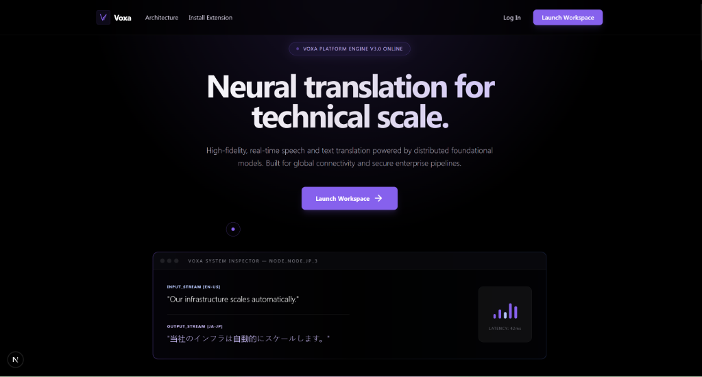
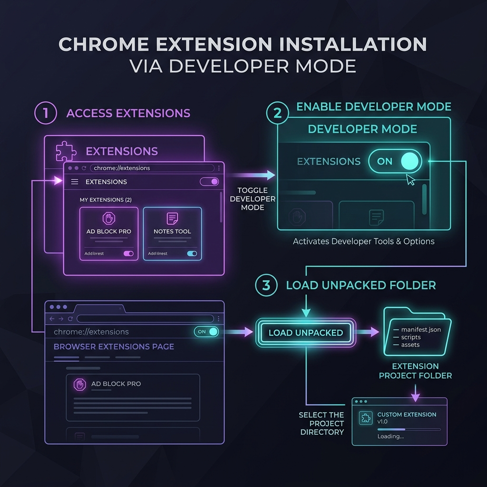

# 🌍 Voxa AI — Real-Time Multilingual Speech Translator



<p align="center">
  <strong>Real-time AI-powered multilingual speech translation platform for Google Meet, online calls, and live browser audio.</strong>
</p>

<p align="center">
  
  
  
  
  
  
</p>

---

## 📸 Product Showcases

### 💻 Real-Time Workspace Dashboard
The core application workspace downsamples microphone signals in the browser, transmits raw Int16 PCM packages to our FastAPI server over WebSockets, and renders speaker-attributed original and translated text side-by-side.
<p align="center">
  
</p>

### 🌍 Google Meet Active Integration
When inside a Google Meet call, clicking the pinned toolbar icon reveals our custom side panel layout. Live translations stream directly into the panel, while a floating widget renders subtitles on top of the meeting tab.
<p align="center">
  
</p>

---

## 🚀 The Voxa Pipeline
Voxa is a high-performance system that captures browser or microphone audio, processes it through multiple sequential AI layers, and streams real-time subtitles back to the client in **under 1 second**.

```
[User speaks / Meeting Audio] 
             │
             ▼
[AudioContext & ScriptProcessor] ──► (Converts Float32 to Int16, downsamples to 16kHz Mono)
             │
             ▼
[WebSocket Channel] ──► (Streams raw PCM chunks to FastAPI in 500ms intervals)
             │
             ▼
[RMS VAD Check] ──► (Skips silence processing to conserve API costs)
             │
             ▼
[Local Speaker Diarizer] ──► (FFT Pitch Analysis detects speaker pitch: e.g. "Speaker A")
             │
             ▼
[Whisper ASR Model] ──► (Transcribes audio into raw, unpunctuated text)
             │
             ▼
[Llama 3.1 Punctuation] ──► (Restores punctuation and sentence structure via Groq)
             │
             ▼
[Llama 3.1 Grammar Fixer] ──► (Refines grammatical errors for high translation accuracy)
             │
             ▼
[NLLB-200 Translation] ──► (Translates corrected text into 200+ NLLB languages)
             │
             ▼
[WebSocket JSON Response] ──► (Streams back translation: displayed on Web App & Injected Floating Widget)
```

---

## ✨ Core Features

### 🎙️ Real-Time WebSocket Streaming
Traditional systems wait for full sentences before translating, causing 5–10 seconds of latency. Voxa uses browser Web Audio downsampling and persistent WebSocket streams to deliver real-time transcripts and translations in **under 1 second**.

### 👤 Local Speaker Diarization
Voxa features a custom, lightweight, zero-dependency speaker diarizer running entirely on the CPU:
* Converts PCM streams into floating points and runs Fast Fourier Transforms (FFT).
* Estimates fundamental voice frequency (F0 pitch) inside the $80\text{ Hz} - 300\text{ Hz}$ range.
* Clusters speakers dynamically (e.g. `Speaker A`, `Speaker B`) with zero PyTorch/GPU overhead.

### 🧠 Sequential AI Refinement Pipeline
Subtitles are processed in a multi-stage NLP pipeline before translation:
1. **ASR:** Captures raw text (e.g., `"hello welcome today we talk about ai"`).
2. **Punctuation:** Restores boundaries (e.g., `"Hello, welcome! Today we will talk about AI."`).
3. **Grammar Correction:** Fixes grammar mistakes without changing meaning.
4. **Direct NLLB Translation:** Translates the grammatically correct, punctuated text into 200+ supported languages.

### 🌐 Chrome Extension (Manifest V3)
* **Google Meet Integration:** Integrates into Google Meet calls.
* **Floating Widget:** Injects a custom subtitle overlay directly onto your active browser tab.
* **Side Panel UI:** Displays chronological conversation transcript logs grouped and color-coded by speaker.

---

## 🛠️ Project Structure
```
Voxa-ai/
├── Backend/                 # Python FastAPI Web Server & AI Engine
│   └── app/
│       ├── api/             # API Router Entrypoints (REST & WebSockets)
│       ├── core/            # Configuration loaders & setup
│       ├── services/        # Business logic (Whisper, NLLB, Diarizer, LLM)
│       └── main.py          # FastAPI application bootloader
│
├── Frontend/my-app/         # Next.js 15 Client Interface
│   ├── public/              # Static assets & packed Voxa.zip
│   └── src/
│       ├── app/             # Landing page & workspace dashboard
│       └── components/      # Modular UI & overlay components
│
└── extension/               # Chrome Extension source
    ├── background/          # Tab capture lifecycle manager
    ├── content/             # Injected floating subtitle widgets
    ├── offscreen/           # Low-level audio context capture page
    └── sidepanel/           # Extension Settings & transcripts list
```

---

## ⚙️ Local Installation & Setup

### 1. Prerequisite API Keys
Create a `.env` file in `Backend/app/.env` and configure your credentials:
```env
# Groq API Key (Used for Llama 3.1 Punctuation & Grammar Correction)
GROQ_API_KEY=your_groq_api_key_here

# OpenAI API Key (Used for Whisper Speech-to-Text)
OPENAI_API_KEY=your_openai_api_key_here

# ElevenLabs API Key (Used for Speech Synthesis)
ELEVEN_LABS_API_KEY=your_eleven_labs_api_key_here
```

### 2. Start the Backend Server
```bash
cd Backend
# Create virtual environment
python -m venv .venv
source .venv/bin/activate  # On Windows: .venv\Scripts\activate

# Install dependencies
pip install -r requirements.txt

# Run the FastAPI server
uvicorn app.main:app --reload --port 8000
```

### 3. Start the Next.js Workspace
```bash
cd Frontend/my-app

# Create local environment config
echo "NEXT_PUBLIC_BACKEND_URL=http://localhost:8000" > .env.local

# Install dependencies
npm install

# Run the development workspace
npm run dev
```
Open [http://localhost:3000](http://localhost:3000) in your browser.

### 4. Load the Chrome Extension
1. Open Chrome and go to `chrome://extensions/`.
2. Enable **Developer Mode** (toggle in the top-right corner).
3. Click **Load Unpacked** (top-left).
4. Select the `extension/` folder inside this project's root directory.
5. Paste your license key (`voxa_local_dev`) inside the Sidepanel dashboard to activate tab capture!

<p align="center">
  
</p>

---

## 🚀 Cloud Deployment

### Backend (Railway)
1. Link your repository to a new **Railway** project.
2. Configure your Environment Variables (`GROQ_API_KEY`, `OPENAI_API_KEY`, etc.) inside the Railway Variables dashboard.
3. Railway will deploy your Python FastAPI app and assign you a production URL (e.g. `https://your-backend.up.railway.app`).

### Frontend (Vercel)
1. Link your repository to **Vercel**.
2. Add the following environment variable inside the Vercel Settings:
   * **Key:** `NEXT_PUBLIC_BACKEND_URL`
   * **Value:** `https://your-backend.up.railway.app` (Do **not** include a trailing slash `/`).
3. Deploy the project. Next.js will build the assets and connect to your Railway server.

---

## 📝 License
This project is licensed under the MIT License.

## 👤 Author
**Priyanshu Raj**  
Computer Science Engineering  
*AI • Full Stack • Systems • Chrome Extensions*
