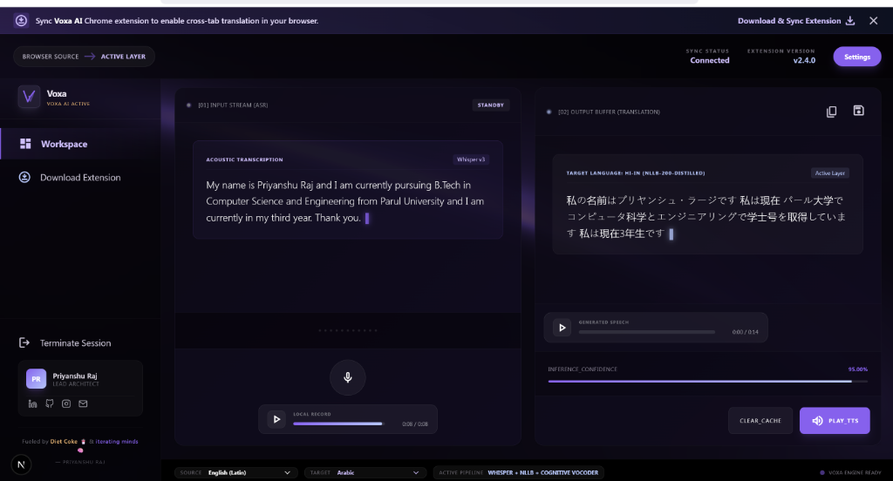
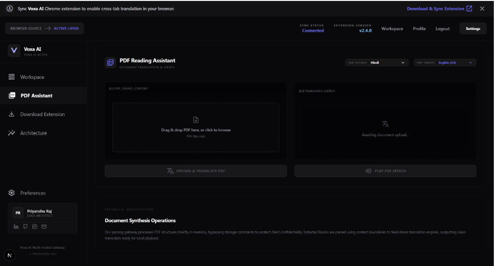
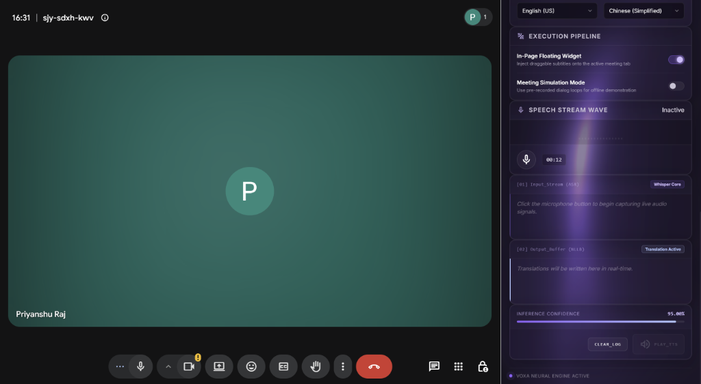

# 🌍 Voxa AI — Real-Time Browser Audio Translator

Voxa AI is a state-of-the-art, real-time speech translation platform. It captures browser tab sound streams or microphone audio, orchestrates them through an optimized sequence of specialized AI modules, and outputs punctuated transcripts, translations, and natural voice syntheses back to the user in sub-second latencies.

🔗 **Production Live Link:** [voxa-ai-pi.vercel.app](https://voxa-ai-pi.vercel.app/)

---

## 📸 Product Showcases

### 💻 Real-Time Workspace Dashboard
The Next.js 16 dashboard allows users to record microphone inputs, upload audio files, and watch progress updates resolve in real time.
<p align="left">
  
</p>

### 📄 AI PDF Reading Assistant
The dedicated document workspace allows users to upload PDF files, extract page text, translate, track generation logs, and download/stream combined ElevenLabs TTS audio back.
<p align="left">
  
</p>

#### 🔄 Under the Hood: The PDF Processing Gateway
When a user uploads a document, the application runs a secure, multi-stage processing pipeline:
* **Secure In-Memory Extraction**: Raw PDF byte streams are parsed directly in-memory using `pypdf`. Bypassing local disk storage protects client confidentiality.
* **Contextual Neural Translation**: The parsed text is translated page-by-page into the target locale.
* **Sentence-Aware Chunking**: To prevent ElevenLabs 10,000 character limit exceptions (`max_character_limit_exceeded`), the translated text is tokenized into chunks between 3,000 and 5,000 characters. It splits on paragraph boundaries (`\n\n`) or sentence endings (`. `), never cutting words or sentences in half.
* **Live Progress Streaming**: The FastAPI backend yields real-time progress text (`Reading page 1...`, `Generating audio part x/y...`) to the Next.js client using line-delimited NDJSON streaming buffers, updating the button loader dynamically.
* **Binary Audio Merger**: All chunked audio parts are written to temp files, compiled sequentially using a binary stream concatenator into a final `output.mp3` file, and served back to the player.


### 🌍 Google Meet Active Integration
The Voxa AI Chrome Extension captures tab audio contextually, presenting subtitle streams in a side panel or as a floating overlay inside active Meet tabs.
<p align="left">
  
</p>

---

## 🚀 The Voxa AI Pipeline Architecture

Voxa AI operates two primary translation flows: **REST-Based File Upload with Streaming Status Updates** and **Real-Time WebSocket Binary Streaming**.

### 1. REST Streaming Pipeline Flow (Workspace Web App)
When uploading or recording audio via the Workspace dashboard, the server processes it via `POST /speech/translate-and-speak`. Instead of blocking, the server yields incremental progress status updates chunk-by-chunk using a Server-Sent Events (SSE) stream to drive the frontend checkmarks.

```
[User Mic Input] ──► [WebM Recording Blob] ──► [POST /speech/translate-and-speak]
                                                           │
                                                           ├──► Step 2: Groq Whisper ASR transcription start
                                                           │
                                                           ├──► Step 3: OpenRouter Claude 3.5 Sonnet correction start
                                                           │
                                                           ├──► Step 4: Azure Neural Translation start
                                                           │
                                                           ├──► Step 5: ElevenLabs synthetic voice generation start
                                                           │
                                                           └──► Step 6: Returns final JSON payload with audio URL
```

### 2. WebSocket Streaming Flow (Chrome Extension)
The Chrome Extension downsamples meeting or tab audio to a clean 16kHz mono 16-bit PCM feed in the background, streaming raw binary chunks over persistent WebSockets in 3-second windows for instant processing.

```
[Google Meet Tab Audio] ──► (Captured via Chrome Offscreen Document)
                                       │
                                       ▼
[Audio Resampler]       ──► (Converts Float32 to 16kHz Mono 16-Bit PCM)
                                       │
                                       ▼
[WebSocket Channel]     ──► (Streams binary chunks to ws://localhost:8000/ws)
                                       │
                                       ▼
[FastAPI Buffer]        ──► (Accumulates chunks in 3-second sliding window)
                                       │
                                       ▼
[Groq Whisper ASR]      ──► (Transcribes raw audio using Whisper large-v3)
                                       │
                                       ▼
[OpenRouter Postprocess]──► (Punctuates & corrects text using Claude 3.5 Sonnet)
                                       │
                                       ▼
[Azure Translator]      ──► (Translates transcript contextually into target language)
                                       │
                                       ▼
[ElevenLabs TTS]        ──► (Synthesizes translated speech voice playback)
                                       │
                                       ▼
[JSON Response]         ──► (Sends transcripts & translations back to client)
```

### 3. PDF Reading Assistant Pipeline Flow (Privacy & Ephemeral Security)
When uploading documents, the server processes them via `POST /pdf/translate`. Large text streams are tokenized into sentence-aware blocks of 3,000–5,000 characters to stay within API limit bounds, translated, and compiled into a joined MP3 play link:

```
[PDF Upload File] ──► [In-Memory Text Parser] ──► [Sentence-Aware Text Splitter]
                                                               │
                                                               ├──► Azure Neural Translation (each chunk)
                                                               │
                                                               ├──► ElevenLabs Audio Synthesis (individual MP3 files)
                                                               │
                                                               ├──► Binary File Merger (combines all chunks to output.mp3)
                                                               │
                                                               └──► Yields real-time progress text via NDJSON Stream
```

#### 🔒 Data Privacy & Zero Retention Policies:
* **Zero Database Storage**: No PDF binary, text dump, or translated transcript is ever written or stored in a persistent backend database.
* **In-Memory Buffer Processing**: The backend handles the uploaded file directly in-memory as a byte array (`BytesIO`). 
* **Transient File Disposal**: Temporary chunk MP3 files created during speech synthesis are immediately deleted and destroyed (`os.remove()`) as soon as the binary merge is completed.
* **Session-Bound Persistence**: The frontend caches the translation text and metadata inside the browser's `sessionStorage`. This data remains locally contained and is wiped out automatically when the user closes the browser tab.

### 4. Authentication & Security Redirection Flow
All core features and workspace pages require active user authorization. The security layer manages access validation, route protection, token expiration, and Sandbox OTP fallbacks:

```
[Unauthenticated User]
      │
      ├─► Tries to access guarded routes (/workspace, /profile, /pdf-reader)
      │   │
      │   ▼ (Client-side mount check: checks for valid JWT cookie)
      │   Intercepts click and redirects immediately to /login?required=true
      │
      ▼
[User Credentials Submit]
      │
      ├─► POST /auth/token ──► Validates hashes against SQLite DB
      │                         │
      │                         ▼
      │                    Returns JWT Bearer Access Token
      │
      ▼ (Client saves JWT securely in cookies)
Access Granted & Profile default preferences loaded contextually
```

#### 🔑 Sandbox OTP Recovery Fallback:
To bypass sandbox limits on free transactional email keys (which restrict OTP delivery only to the account owner):
* **Resilient Exception Catching**: If the Resend API email transmission fails, the server catches the exception and outputs the code directly to the secure terminal console (`🔑 OTP FOR TESTING (recipient): <otp>`), allowing sandbox testing environments to log in seamlessly.


---

## ✨ Core Features & Technical Stack

* **WebSocket PCM Streaming:** Downsamples browser audio to 16kHz mono PCM and streams it continuously to achieve sub-second latencies.
* **Server-Sent Events (SSE) Progress:** Visual step checklist updates are synchronized 100% with server execution milestones (ASR, post-refine, translate, TTS synthesis).
* **AI PDF Reading Assistant:** Translates large PDF files using in-memory byte extraction, sentence-boundary text chunking (3k-5k char segments), and multi-part voice syntheses.
* **Smart Audio Merger:** Sequentially synthesizes text segments and merges the resulting MP3 payloads into a single file with resilient warning fallbacks.
* **ASR Transcript Correction:** Raw transcriptions from Whisper large-v3 are sent through **Claude 3.5 Sonnet via OpenRouter** to correct homophones, insert punctuation, and fix grammar before translation.
* **Azure Translation Layer:** Fully contextual text translation into 45+ supported target locales using Azure Cognitive Services.
* **Expressive Synthesizer:** Integrates ElevenLabs Voice Synthesis (using `eleven_multilingual_v2`) to generate natural speech playback.
* **Floating Subtitle Injection:** Injects a secure floating overlay widget directly into Google Meet browser tabs.

---

## 🛠️ Project Directory Tree

```
Voxa-ai/
├── Backend/                 # Python FastAPI Web Server & AI Engine
│   └── app/
│       ├── api/             # API Router Endpoints (REST & WebSockets)
│       │   ├── health.py    # Health checks
│       │   ├── pdf.py       # PDF extraction & chunked translation stream
│       │   ├── speech.py    # REST Translation & serving output-audio
│       │   └── websocket_api.py # WebSocket Stream Gateway
│       ├── core/            # Config variables & settings
│       ├── services/        # Logic Handlers (STT, Postprocess, Translation, TTS)
│       │   ├── speech_service.py      # Groq Whisper
│       │   ├── postprocess_service.py # OpenRouter Claude 3.5 Sonnet
│       │   ├── translation_service.py # Azure Translator API
│       │   └── tts_service.py         # ElevenLabs TTS
│       └── main.py          # FastAPI server loader
│
├── Frontend/my-app/         # Next.js 16 Web Dashboard
│   ├── public/              # Static assets & Packed extension voxa_entension.zip
│   └── src/
│       ├── app/             # Page routing & pages (Landing, workspace, pdf-reader, profile, settings)
│       └── components/      # Responsive design systems
│
└── Extension/               # Chrome Extension source
    ├── background/          # Background worker capturing tab streams
    ├── content/             # Floating subtitles DOM injection scripts
    ├── offscreen/           # Offscreen audio context recorder
    └── sidepanel/           # sidepanel settings & logs layout
```

---

## ⚙️ Local Setup & Configuration

### 1. Configure Backend Environment
Create a `.env` file in `Backend/app/.env` with your API credentials:
```env
# Groq API Key (Used for Whisper STT)
GROQ_API_KEY=your_groq_api_key_here

# OpenRouter API Key (Used for Claude Sonnet 4 post-processing)
OPENROUTER_API_KEY=your_openrouter_key_here

# Azure Translator Details (Used for text translation)
AZURE_TRANSLATOR_KEY=your_azure_translator_key_here
AZURE_TRANSLATOR_REGION=centralindia
AZURE_TRANSLATOR_ENDPOINT=https://api.cognitive.microsofttranslator.com/

# ElevenLabs API Key (Used for voice synthesis playback)
ELEVENLABS_API_KEY=your_eleven_labs_key_here

BACKEND_URL=http://localhost:8000
FRONTEND_URL=http://localhost:3000
```

### 2. Startup Backend
```bash
cd Backend
python -m venv .venv
source .venv/bin/activate  # On Windows: .venv\Scripts\activate
pip install -r requirements.txt
uvicorn app.main:app --reload --port 8000
```

### 3. Startup Frontend
```bash
cd Frontend/my-app
echo "NEXT_PUBLIC_BACKEND_URL=http://localhost:8000" > .env.local
npm install
npm run dev
```
Open [http://localhost:3000](http://localhost:3000) to view the web workspace.

### 4. Load the Extension
1. Open Chrome and navigate to `chrome://extensions/`.
2. Toggle **Developer Mode** on in the top-right.
3. Click **Load Unpacked** in the top-left.
4. Select the `Extension` directory in the root of this project.
5. Use the shortcut `Ctrl + Shift + U` or click the Voxa AI icon to start translating your meetings!

---

## 👥 Authors
* **Priyanshu Raj** - Computer Science Engineer & Architect.
